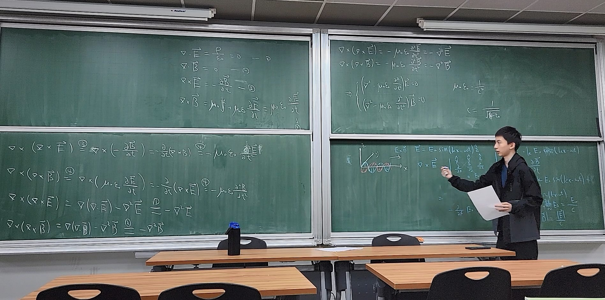

# About Ray Chien, 簡睿均

<i>Presenting at high school physics study group, 2024</i>

## Education

- B.S., Department of Electrical Engineering, National Taiwan University (Undergraduate, 2026 - Present)
- B.S., Department of Electrophysics, National Yang Ming Chiao Tung University (2025 - 2026, Transferred)
- 師大附中 1587 科學班 (2022 - 2025)
- 介壽國中 數理資優班 (2019 - 2022)
- 民權國小 資優班 (2013 - 2019)

## Contact Me

- Email: jianr342@gmail.com

## Links

- GitHub: [RayChien01](https://github.com/RayChien01)

- WakaTime: [rayChien](https://wakatime.com/@rayChien)

- Instagram: [raychien01](https://www.instagram.com/raychien01/)

- Facebook: [簡睿均](https://www.facebook.com/RayChienOwO/)

- Threads: [raychien01](https://www.threads.com/@raychien01)

- lichess.org: [RayChien](https://lichess.org/@/RayChien)