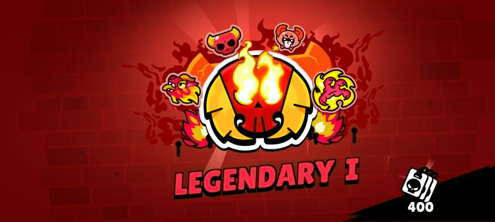

# Culture Log

## Music

I started playing the violin when I was 9. I am not professional. I stopped taking formal lessons in 2025, but I continue to enjoy playing and learning from books like *The Basics.* I was a member of the orchestras at 民權國小, 介壽國中, 師大附中(HSNU), and 交通大學(NYCU).

### Music Pieces Played

#### 2025 and Before

- J.S. Bach: Partita for Violin Solo No. 2 in D minor, BWV 1004
- J.S. Bach: Concerto for Two Violins in D minor, BWV 1043
- Lalo: Symphonie Espagnole in D minor, Op. 21, 1st
- Mendelssohn: Violin Concerto in E minor, Op. 64
- Saint-Saëns: Violin Concerto No. 3 in B minor, Op. 61
- Wieniawski: Violin Concerto No. 2 in D minor, Op. 22, 3rd
- Wieniawski: Polonaise de Concert No. 1 in D Major, Op. 4

### Still Practicing

- Tchaikovsky: Violin Concerto in D major, Op. 35, 3rd
- Sibelius: Violin Concerto in D minor, Op. 47, 1rd

### Playlists of Modern Music

In modern fast-paced society leaves little time for me to appreciate classical music. These the link are my two playlists of modern music on YouTube Music.

- [modern](https://music.youtube.com/playlist?list=PLcepGEkFxV5Q&si=LsyZqLVJp6BNXRcG)
- [vocal](https://music.youtube.com/playlist?list=PLbGjvekiaMGn1E_ptoVQPUPquHzGJMu4w&si=_t_C1wFd1dygyfwM)

## Reading

### The Books I Have Read 

#### 2026

- Play Winning Chess by Yasser Seirawan

## TV Time

### The Movies I Have Watched

(which are good enough for me to remember)

#### 2024 and Before
- Breakfast at Tiffany's (1961)
- Rome Holiday (1953)
- Life is Beautiful (1997)
- Midnight in Paris (2011)
- City Lights (1931)
- The Great Dictator (1940)
- The Kid (1921)
- Modern Times (1936)

#### 2025
- La La Land (2016)
- Love Actually (2003)
- Casino Royale (2006)
- Johnny English 1-3 (2003, 2011, 2018)

#### 2026
- Quantum of Solace (2008)
- Grave of the Fireflies (1988)
- Pressure (2026)

### The Series I Have Watched
(which are good enough for me to watch the episodes in roll)

#### 2025
- Wednesday season 1 (2022)

#### 2026
- Queen's Gambit (2020)

## Video Games

### Minecraft

Playing survival with [the one who failed to load his shader package].(https://www.instagram.com/scxxcla_.o._hsiao/)

### Brawl Stars

Hitting Legendary with [the one who has](https://www.instagram.com/ronald96419/) and [the one who hasn't](https://www.instagram.com/fredkao1220/) beat me in 1v1.